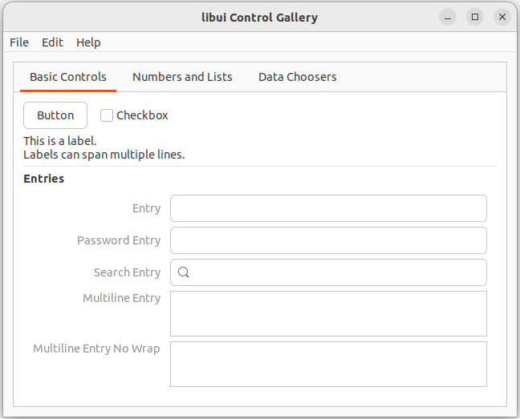
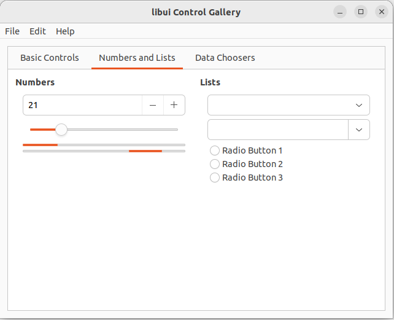
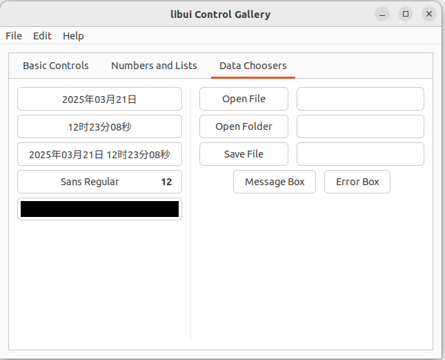
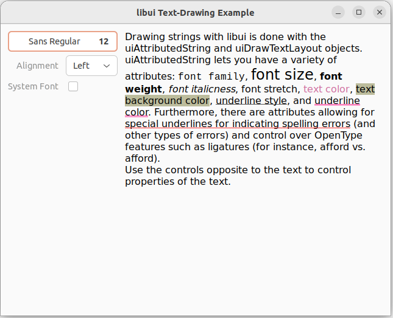
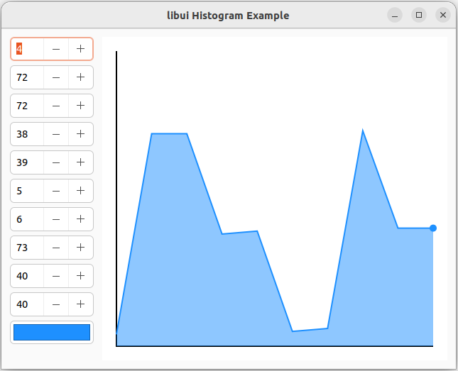
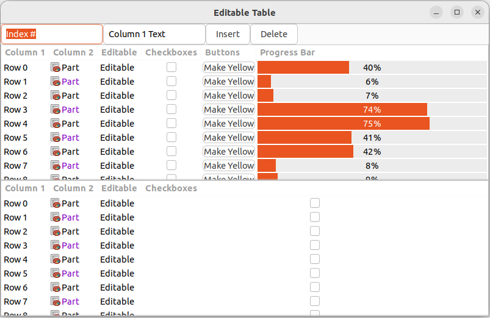

# libui-Beef
A Beef language binding for [libui-ng](https://github.com/libui-ng/libui-ng)

## Simple Example
Below example displays a blank window.

```cs
using libui;
using System;

namespace libuitest1;

class Program
{
    static int32 OnClosing(__IntPtr w, __IntPtr data)
    {
        ui.UiQuit();
        return 1;
    }

    static int Main()
    {
        let err = ui.UiInit(scope .());
        if (err != null) {
            Console.Error.WriteLine("Error initializing libui-ng: {0}", scope String(err));
            ui.UiFreeInitError(err);
            return 1;
        }
        defer ui.UiUninit();

        // Create a new window
        let w = ui.UiNewWindow("Hello World!", 300, 200, 0);
        ui.UiWindowOnClosing(w, scope => OnClosing, null);

        ui.UiControlShow((UiControl)w);
        ui.UiMain();
        return 0;
    }
}
```

## Supported Platforms
- Windows x86
- Windows x64
- Linux x64 (GNOME)

## Screenshots

- Windows

<table style="table-layout:fixed">
  <tr>
    <td colspan="3">controlgallery</td>
  </tr>
  <tr>
    <td width="33.33%"></td>
    <td width="33.33%"></td>
    <td width="33.33%"></td>
  </tr>
  <tr>
    <td>drawtext</td>
    <td>histogram</td>
    <td>edittable</td>
  </tr>
  <tr>
    <td></td>
    <td></td>
    <td></td>
  </tr>
</table>

- Ubuntu Linux

<table style="table-layout:fixed">
  <tr>
    <td colspan="3">controlgallery</td>
  </tr>
  <tr>
    <td width="33.33%"></td>
    <td width="33.33%"></td>
    <td width="33.33%"></td>
  </tr>
  <tr>
    <td>drawtext</td>
    <td>histogram</td>
    <td>edittable</td>
  </tr>
  <tr>
    <td></td>
    <td></td>
    <td></td>
  </tr>
</table>

## Tips
- libui-beef supports importing from remote, follow below steps:

  1. In IDE, right clicks "Workspace" node, selects "Add From Remote...".

  

  2. In opened dialog, inputs project URL for libui-beef.

  

  3. You can refresh newest libui-beef by right clicking "libui-beef" node, then selecting "Update Version Lock".

  

## Links
 - [libui](https://github.com/andlabs/libui)
 - [libui-ng](https://github.com/libui-ng/libui-ng)
 - [Beef Lang](https://www.beeflang.org/)
