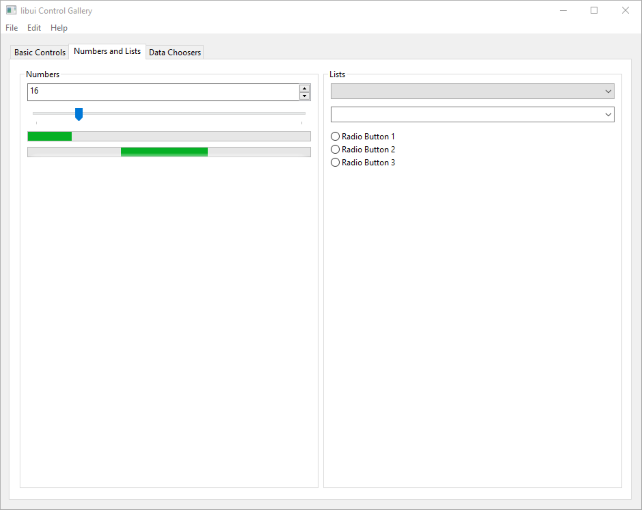
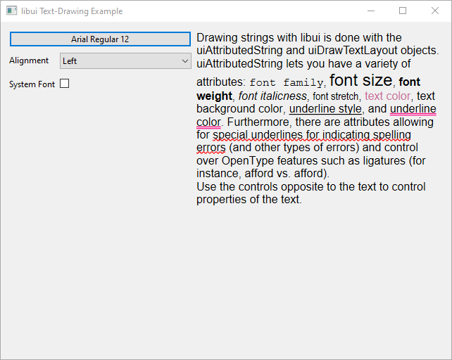

# libui-Beef
A Beef language binding for [libui-ng](https://github.com/libui-ng/libui-ng)

## Screenshots

From examples/controlgallery:





From examples/drawtext:



From examples/histogram:


## Simple Example
Below example displays a blank window.

```cs
using libui;
using System;

namespace libuitest1;

class Program
{
    static int32 OnClosing(__IntPtr w, __IntPtr data)
    {
    	ui.UiQuit();
    	return 1;
    }

    static TTo Cast<TTo, TFrom>(TFrom val)
    {
        var val;
        return *(TTo*)&val;
    }

    static int Main()
    {
        var o = scope UiInitOptions();
        var err = ui.UiInit(o);
        if (err != null) {
            Console.Error.WriteLine("Error initializing libui-ng: {0}", scope String(err));
         	ui.UiFreeInitError(err);
        	return 1;
        }

        // Create a new window
        var w = ui.UiNewWindow("Hello World!", 300, 200, 0);
        ui.UiWindowOnClosing(w, scope => OnClosing, null);

        ui.UiControlShow(Cast<UiControl...>(w));
        ui.UiMain();
        ui.UiUninit();
        return 0;
    }
}
```
